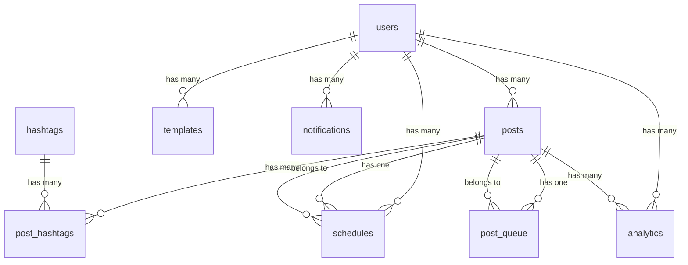

# 📊 Threads System データベース設計書

## 概要
Threads自動投稿システムのための包括的なデータベース設計。PostgreSQL（Supabase）を使用。

## 🏗️ データベース構造

### 1. users（ユーザー）
**目的**: システムユーザーの管理と認証情報の保存

| カラム名 | 型 | 説明 |
|---------|-----|------|
| id | UUID | 主キー |
| username | VARCHAR(50) | ユーザー名（一意） |
| email | VARCHAR(255) | メールアドレス（一意） |
| password_hash | VARCHAR(255) | パスワードハッシュ |
| role | VARCHAR(20) | ユーザー権限（admin/user/guest） |
| threads_access_token | TEXT | Threads APIトークン（暗号化推奨） |
| settings | JSONB | ユーザー設定（通知、プライバシー等） |

**インデックス**: username, email, status

---

### 2. posts（投稿）
**目的**: 投稿コンテンツの管理

| カラム名 | 型 | 説明 |
|---------|-----|------|
| id | UUID | 主キー |
| user_id | UUID | ユーザーID（外部キー） |
| content | TEXT | 投稿内容 |
| media_urls | TEXT[] | メディアURL配列 |
| status | VARCHAR(20) | ステータス（draft/scheduled/published/failed） |
| threads_post_id | VARCHAR(100) | Threads側の投稿ID |
| scheduled_at | TIMESTAMP | 予約投稿時刻 |
| published_at | TIMESTAMP | 実際の投稿時刻 |
| metrics | JSONB | エンゲージメント指標 |

**インデックス**: user_id, status, scheduled_at, published_at

---

### 3. hashtags（ハッシュタグ）
**目的**: ハッシュタグの管理と分析

| カラム名 | 型 | 説明 |
|---------|-----|------|
| id | UUID | 主キー |
| name | VARCHAR(100) | ハッシュタグ名（#なし） |
| normalized_name | VARCHAR(100) | 正規化名（小文字） |
| usage_count | INTEGER | 使用回数 |
| trend_score | DECIMAL | トレンドスコア |
| category | VARCHAR(50) | カテゴリ |

**インデックス**: normalized_name, usage_count, trend_score

---

### 4. post_hashtags（投稿-ハッシュタグ関連）
**目的**: 多対多の関係を管理

| カラム名 | 型 | 説明 |
|---------|-----|------|
| post_id | UUID | 投稿ID（外部キー） |
| hashtag_id | UUID | ハッシュタグID（外部キー） |
| position | INTEGER | ハッシュタグの位置 |

**複合主キー**: (post_id, hashtag_id)

---

### 5. schedules（スケジュール）
**目的**: 予約投稿のスケジュール管理

| カラム名 | 型 | 説明 |
|---------|-----|------|
| id | UUID | 主キー |
| user_id | UUID | ユーザーID |
| post_id | UUID | 投稿ID |
| scheduled_time | TIMESTAMP | 予定時刻 |
| timezone | VARCHAR(50) | タイムゾーン |
| repeat_type | VARCHAR(20) | 繰り返しタイプ |
| status | VARCHAR(20) | ステータス |
| retry_count | INTEGER | リトライ回数 |

**インデックス**: user_id, scheduled_time, status

---

### 6. templates（テンプレート）
**目的**: 投稿テンプレートの管理

| カラム名 | 型 | 説明 |
|---------|-----|------|
| id | UUID | 主キー |
| user_id | UUID | ユーザーID |
| name | VARCHAR(100) | テンプレート名 |
| content_template | TEXT | コンテンツテンプレート |
| variables | JSONB | 変数定義 |
| usage_count | INTEGER | 使用回数 |

---

### 7. analytics（分析データ）
**目的**: 投稿パフォーマンスの追跡

| カラム名 | 型 | 説明 |
|---------|-----|------|
| id | UUID | 主キー |
| user_id | UUID | ユーザーID |
| post_id | UUID | 投稿ID |
| date | DATE | 日付 |
| impressions | INTEGER | インプレッション数 |
| engagements | INTEGER | エンゲージメント数 |
| metrics | JSONB | 詳細メトリクス |
| audience_data | JSONB | オーディエンス情報 |

**インデックス**: user_id, post_id, date

---

### 8. post_queue（投稿キュー）
**目的**: 投稿処理のキュー管理

| カラム名 | 型 | 説明 |
|---------|-----|------|
| id | UUID | 主キー |
| user_id | UUID | ユーザーID |
| post_id | UUID | 投稿ID |
| priority | INTEGER | 優先度（1-10） |
| scheduled_for | TIMESTAMP | 処理予定時刻 |
| status | VARCHAR(20) | ステータス |

**インデックス**: status, scheduled_for, priority

---

### 9. notifications（通知）
**目的**: ユーザー通知の管理

| カラム名 | 型 | 説明 |
|---------|-----|------|
| id | UUID | 主キー |
| user_id | UUID | ユーザーID |
| type | VARCHAR(50) | 通知タイプ |
| title | VARCHAR(200) | タイトル |
| message | TEXT | メッセージ |
| is_read | BOOLEAN | 既読フラグ |

---

### 10. audit_logs（監査ログ）
**目的**: システム操作の記録

| カラム名 | 型 | 説明 |
|---------|-----|------|
| id | UUID | 主キー |
| user_id | UUID | ユーザーID |
| action | VARCHAR(100) | アクション |
| entity_type | VARCHAR(50) | エンティティタイプ |
| old_values | JSONB | 変更前の値 |
| new_values | JSONB | 変更後の値 |

---

## 🔗 リレーション図



## 🔒 セキュリティ設計

### Row Level Security (RLS)
- 各ユーザーは自分のデータのみアクセス可能
- 管理者は全データにアクセス可能
- 公開テンプレートは全ユーザーが閲覧可能

### 暗号化対象
- パスワード（bcrypt）
- Threads APIトークン
- 個人情報を含むJSONBフィールド

### インデックス戦略
- 頻繁に検索される列にインデックス
- 複合インデックスで複数条件検索を最適化
- 部分インデックスでアクティブレコードのみ対象

## 📈 パフォーマンス最適化

### ビュー
1. **post_details** - 投稿詳細情報の集約ビュー
2. **daily_analytics_summary** - 日次分析サマリー

### トリガー
- `updated_at`自動更新トリガー（全テーブル）
- ハッシュタグ使用回数自動更新
- 投稿メトリクス自動集計

### ストアドプロシージャ
- `normalize_hashtag()` - ハッシュタグ正規化
- `calculate_engagement_rate()` - エンゲージメント率計算
- `get_user_stats()` - ユーザー統計取得

## 🚀 実装手順

### 1. Supabaseプロジェクト作成
```bash
1. https://supabase.com でアカウント作成
2. 新規プロジェクト作成
3. SQL Editorでスキーマ実行
```

### 2. SQLスキーマ実行
```sql
-- Supabase SQL Editorで実行
-- supabase-schema.sql の内容をコピー＆ペースト
```

### 3. 環境変数設定
```env
SUPABASE_URL=https://xxxxx.supabase.co
SUPABASE_ANON_KEY=eyJhbGc...
SUPABASE_SERVICE_KEY=eyJhbGc...
DATABASE_URL=postgresql://...
```

### 4. アプリケーション接続
```javascript
const { createClient } = require('@supabase/supabase-js');
const supabase = createClient(
  process.env.SUPABASE_URL,
  process.env.SUPABASE_SERVICE_KEY
);
```

## 📊 データ容量見積もり

### 想定規模（1ユーザーあたり）
- 投稿: 月100件 × 12ヶ月 = 1,200件/年
- 分析データ: 365日 × 24時間 = 8,760レコード/年
- ストレージ: 約10MB/年

### Supabase無料枠
- データベース: 500MB
- ストレージ: 1GB
- 帯域幅: 2GB/月
- **約50ユーザーまで無料枠で運用可能**

## 🔧 メンテナンス

### 定期実行タスク
1. **日次**: 古い通知の削除
2. **週次**: 分析データの集計
3. **月次**: 監査ログのアーカイブ
4. **年次**: 古いデータの圧縮

### バックアップ戦略
- Supabase自動バックアップ（毎日）
- 重要データのエクスポート（週次）
- 監査ログの外部保存（月次）

## 📝 今後の拡張案

### Phase 2
- メディア管理テーブル
- チーム/組織管理
- AIコンテンツ生成履歴
- A/Bテスト管理

### Phase 3
- マルチプラットフォーム対応（Instagram, X等）
- 高度な分析（感情分析、トレンド予測）
- コラボレーション機能